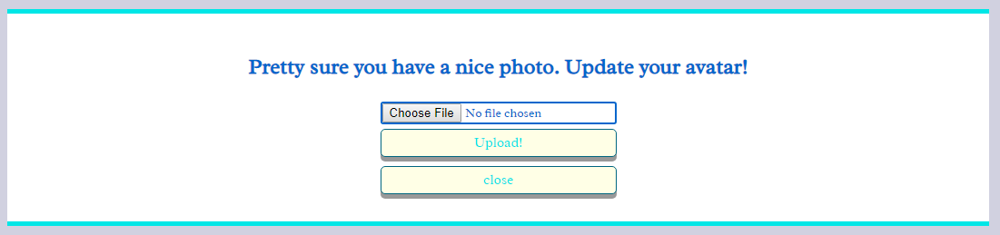

# Final Project - Mess Around
* This is the final project I had done for SPICED Academy. This is also a theme-free project, we shall create a project based on our preference and creativity. Due to the interest in Node.js, React.js, Redux and Socket.io, I created another social-network project that was similar to [my previous project](https://github.com/Ee-Chee/SpicedAcademy-Tabasco-SocialNetwork-Week9to11).
* Comparing to the previous one, I added more features in this project and also improved the css design, making it looked more rigid and professional.
* The name of this project is called Mess Around. Apart from its social-network feature, it allows users to create a FOREX demo account. Here is where users mess around their capital in a demo account. Users open a position(buy or sell currency pairs) as they want with the fake money. The FOREX market is based on real-time market out there. In another words, users learn about risk management and market analysis in a real-time market basis on my site. There are also other additional features described in the following section. Very interesting? I know right, get yourself an account and have fun: https://m-around.herokuapp.com/.   

## Features
1) Better CSS design
* While CSS might be very easy to learn, it could be very challenging and time-consuming when it comes to a professional design and implementation.
* In this project, I standardized the colours, fonts, borders, paddings and margins used, making all UIs look more professional and user-friendly.
* Unfortunately, it is not responsive to all devices. If you are interested in my responsive project, click [this project - Petition](https://github.com/Ee-Chee/SpicedAcademy-Tabasco-Petition-Week7) and the [site](https://eechee.herokuapp.com/).

2) Welcome page
* Users who first visit the website or log-out users(cookies deleted) will be redirected to this page. This parent component contains 5 child components.
* Introduction component gives the overview of this site.
* Features component describes the main features of the site.
* A little description about me can be found in 'About Me' tab, the About component.
* Registration component allows new users to register an account. All fields are required and '@' must be included in your email address. Otherwise, it prompts an error message.
* Lastly, login component is made for the users who already had an account and they wish to revisit the site again. Welcome back.

3) Top menu
* After registration or logging-in, users are redirected to 'My Profile' tab. Same goes to those cookie holders as well. Before I proceed to the introduction of 'My Profile' tab, I would like to brief about the functionalities of top menu as shown in the figure below.

* Basically, top menu holds the logo, user ID, avatar and two clickable icons: log-out button and profile picture uploader.
* Just like the blue cloud icon, the avatar is also clickable. As they are clicked, profile picture uploader functionality is triggered. User is able to change their avatar here. Default user image will be set if no avatar is uploaded. 

4) 'My Profile' tab
* 'My Profile' tab simply shows avatar, registered first name, last name, the bio of the user, masterpieces, added friends and friendship requesters.
* Users can describe more about themselves by adding bio data here. Editing is possible after saving.

* Remember this special section, 'My masterpieces', this section will be used again when we talk about the 'React-SocketIO' tab. The canvas data url saved in 'React-SocketIO' will be displayed as an image in this section.

* Once user adds some other users/messers, their profile card will be shown in 'My added Messers'. Upon clicking, user can see their profile, start privat-chatting with them and the most fun part, check out their masterpieces if they have any. 
* 'Unfriend' button is also available to remove them from user's friend list.

* Lastly, user can also check the profile of those who want to befriend her. These requesters are listed in 'These people wanna mess-around together with you'. 
* Hit the 'accept the request' button to befriend them.

5) 'Chart Analysis' tab
* This is where users can create a demo account and mess around in FOREX market with fake money. 
* The trading platform used is called 'Metatrader5'. Open an account and try it out!
* Note the market is closed from Friday night till Sunday night. During this period, user cannot trade nor check the market price. 

6) 'Finding Nemo' tab
* Users can find other users here by inserting their registered first name and last name in the given input field. It is not character sensitive. All the results matched will be shown.
* The displayed results include the avatar of the matched users, their first name and last name.
* If no results found, a message for that will pop out.
* In addition, all the current online users can be seen in 'All online Messers'.

* All these shown profile cards are clickable. Same as clicking the profile cards shown on 'My Profile' tab, after clicking, user can check others' bio data, name, avatar and masterpieces or even private-chat, befriend and unfriend them.  

* There is another way of looking for other user's profile, i.e. by changing ID number in the url. For an example, if the particular friend has an ID number of 2, alter the url to https://m-around.herokuapp.com/user/2. If one changes the ID number to her own ID, she will be redirected to 'My Profile' tab.

7) Private chat
* Like most of the messaging apps out there, this feature makes use of SocketIO to allow users to chat with each other or even leave a message to the offline users.
* A private-chat window will pop out as user clicks the 'privat-chat' button on other user's profile. User can send other user as many messages as they want. There is a scrollable bar, history of the chats can be seen. However when there is a new message coming in, it is automatically navigated to the bottom of the bar where the new message is shown. 

* Additional feature for private-chat. As the third person is trying to send a message to the user who is chatting with someone else, the sent message will appear on top of the screen, telling the user that she has a new message from others. The message lasts for only 5 seconds before it disappears.

8) 'Forex Forum' tab
* In this UI, user can cast a topic(e.g. financial crisis, what is FOREX) and all the other users are welcome to leave their comments, thoughts or feelings here. Similar functionalities as privat-chat, users can discuss about the given topic together and check the history of the discussion.   

9) 'React-SocketIO' tab
* This part is a real-time multi-player mini game of drawing. The feature allows all the online users to join the 'stick-man' drawing at the same time. Users can build a masterpiece together with their friends or even strangers. 
* There are two buttons available here: 'Again'- remove everything and do it together again, 'Save it to profile'- save the drawing to 'My Masterpieces' on 'My Profile' tab. 

**_NOTES_**:
* Coding technologies: HTML, CSS, Javascript, JSON, DOM, Axios+crsf, Canvas, React.js, Redux, Node.js, Express, multer, bcrypt, compression, Jest(Enzyme), Postgresql, cookie-session and Socket-io.  
* Third party tools: Amazon Web Services(S3 storage), Fontawesome-Icons, ReduxDevTools, GoogleFonts and Webpack.

Thank you for reading. 10 out of 10 likes to this project. 
